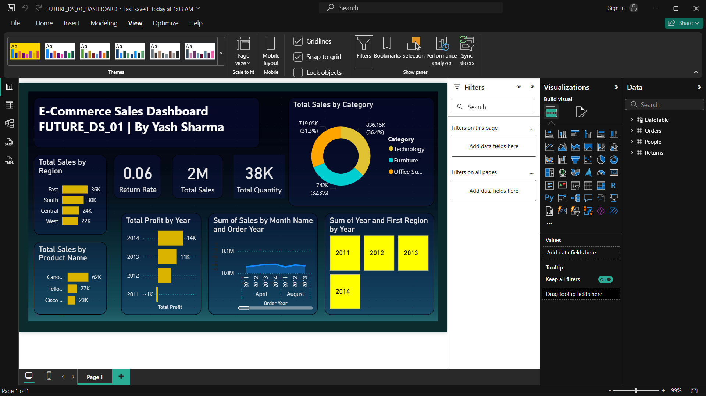

# 🛒 E-Commerce Sales Dashboard

An interactive Power BI dashboard designed to analyze e-commerce sales data, track performance, and generate actionable business insights.

---

## 📌 Project Objective

The goal of this project is to analyze e-commerce sales data to understand customer behavior, sales trends, and overall business performance. The dashboard helps in making data-driven decisions.

---

## 📊 Dashboard Overview

This dashboard provides insights into:

- Total Sales & Revenue  
- Profit Analysis  
- Category-wise Sales  
- Customer Segmentation  
- Region-wise Performance  

---

## 📈 Key Insights

- Identified top-performing product categories  
- Analyzed profit trends across regions  
- Found seasonal sales patterns  
- Highlighted customer purchasing behavior  

---

## 🛠️ Tools & Technologies

- **Power BI**
- **Data Cleaning**
- **Data Modeling**
- **DAX**
- **Data Visualization**

---

## 📷 Dashboard Preview

---

## 💡 Features

- Interactive filters and slicers  
- Dynamic charts and KPIs  
- Clean and user-friendly design  

---

## 🎯 Conclusion

This project demonstrates how business data can be transformed into meaningful insights using Power BI, helping organizations improve sales strategy and performance.

---

## 👤 Author

**Yash Sharma**

🔗 [LinkedIn](https://www.linkedin.com/in/yash-sharma-5527ab398)
🔗 [GitHub](https://github.com/hsaysh)

---

## ⭐ Support

If you found this project useful, please give it a ⭐ on GitHub!

